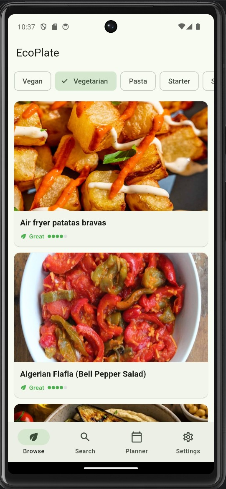
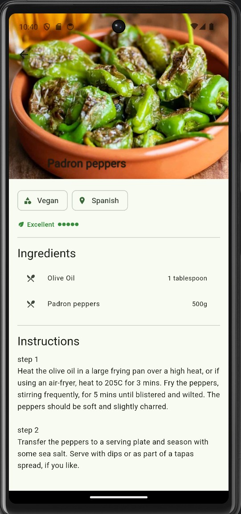
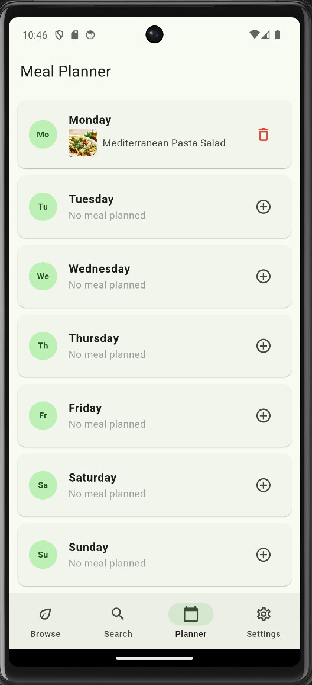
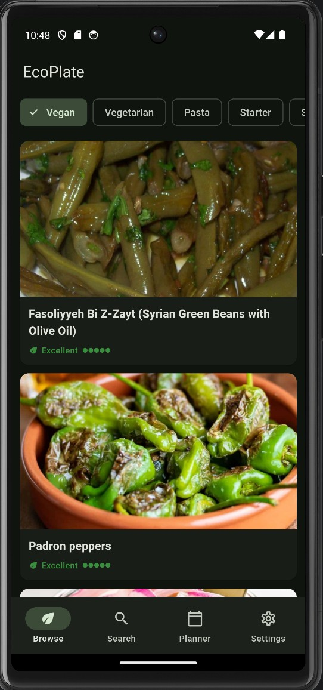

# EcoPlate — Eco-Friendly Recipe & Meal Planner

A Flutter mobile application that helps users discover eco-friendly recipes, plan weekly meals, and understand the environmental impact of their food choices.

Built as a Mobile Applications exam project at **TAMK (Tampere University of Applied Sciences)**.

---

## Features

- **Browse Recipes** — Browse recipes by eco-friendly categories (Vegan, Vegetarian, Pasta, Seafood, etc.) with infinite scroll pagination
- **Eco Score** — Every recipe gets an eco score (1–5 leaves) based on its environmental impact
- **Recipe Details** — Full ingredients list, cooking instructions, and YouTube video link
- **Search** — Search recipes by name with input validation
- **Weekly Meal Planner** — Assign recipes to each day of the week; plan persists across sessions
- **Dark Mode** — System-aware dark/light theme toggle
- **Offline persistence** — Meal plan saved locally with SharedPreferences

---

## Tech Stack

| Layer | Technology |
|---|---|
| Framework | Flutter 3.41.6 / Dart 3.11.4 |
| State management | flutter_riverpod 3.3.1 |
| Navigation | go_router 17.2.3 |
| Local storage | shared_preferences 2.5.5 |
| Image loading | cached_network_image 3.4.1 |
| HTTP | http 1.6.0 |
| Data source | [TheMealDB API](https://www.themealdb.com/api.php) |

---

## Architecture

```
lib/
├── main.dart                    # App entry point
├── models/                      # Data models (Recipe, MealPlan)
├── services/                    # API service (TheMealDB)
├── providers/                   # Riverpod state providers
├── router/                      # GoRouter configuration
├── screens/                     # UI screens
│   ├── browse_tab.dart          # Recipe browsing with categories
│   ├── search_screen.dart       # Recipe search
│   ├── meal_planner_screen.dart # Weekly planner
│   ├── recipe_detail_screen.dart # Recipe details
│   └── settings_screen.dart    # Theme & about
└── widgets/                     # Reusable widgets (RecipeCard, EcoBadge)
```

---

## Screenshots

| Browse | Recipe Detail | Meal Planner | Dark Mode |
|---|---|---|---|
|  |  |  |  |

## Getting Started

### Prerequisites
- Flutter 3.41.6 or later
- Android SDK (API 33+) or iOS 12+
- Internet connection (fetches recipes from TheMealDB)

### Run the app

```bash
git clone https://github.com/yasaswijethunga/Meal-Planner-App.git
cd ecoplate
flutter pub get
flutter run
```

### Run tests

```bash
flutter test
```

**36 tests passing** across models, services, validators, and widgets.

---

## Team

A collaboration between **TAMK** (Tampere University of Applied Sciences, Finland) and **THWS** (Technische Hochschule Würzburg-Schweinfurt, Germany).

| Name | Email | Institution |
|---|---|---|
| Yasas Wijethunga | yasas.wijethunga@tuni.fi | TAMK |
| Waruna Bandara Rathnamalala | waruna.rathnamalalabandaralage@tuni.fi | TAMK |
| Maha Maligaspe | maha.maligaspe@tuni.fi | TAMK |
| Noah Frei | noah.frei@study.thws.de | THWS |
